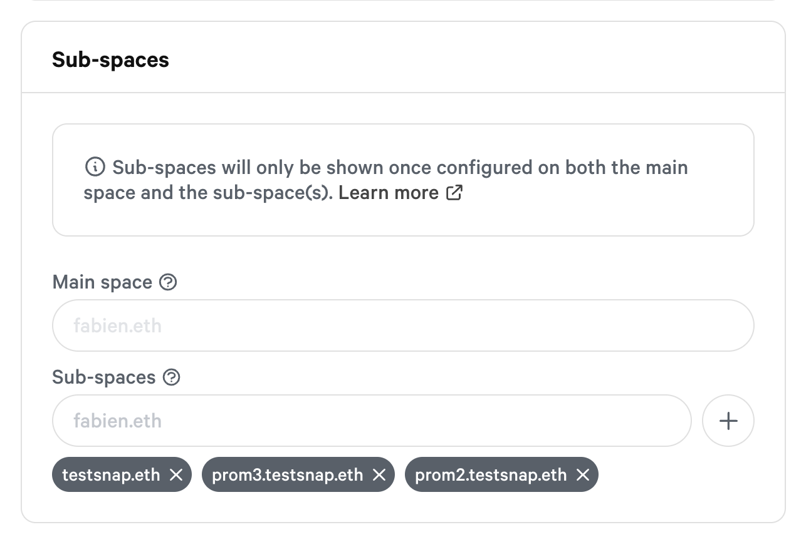

# GraphQL API

Try the GraphQL API here:





### Get a single space

#### Arguments

id `string`

#### Example



```graphql
query {
  space(id: "yam.eth") {
    id
    name
    about
    network
    symbol
    members
  }
}
```



```javascript
{
  "data": {
    "space": {
      "id": "yam.eth",
      "name": "Yam Finance",
      "about": "",
      "network": "1",
      "symbol": "YAM",
      "members": [
        "0x683A78bA1f6b25E29fbBC9Cd1BFA29A51520De84",
        "0x9Ebc8AD4011C7f559743Eb25705CCF5A9B58D0bc",
        "0xC3edCBe0F93a6258c3933e86fFaA3bcF12F8D695",
        "0xbdac5657eDd13F47C3DD924eAa36Cf1Ec49672cc",
        "0xEC3281124d4c2FCA8A88e3076C1E7749CfEcb7F2"
      ]
    }
  }
}
```



Try on [GraphiQL](https://hub.snapshot.page/graphql?query=query%20%7B%0A%20%20space%28id%3A%20%22yam.eth%22%29%20%7B%0A%20%20%20%20id%0A%20%20%20%20name%0A%20%20%20%20about%0A%20%20%20%20network%0A%20%20%20%20symbol%0A%20%20%20%20members%0A%20%20%7D%0A%7D)

### Get multiple spaces

#### Arguments

first `number`  
skip `number`  
orderBy `string`  
orderDirection `asc` or `desc`

#### Example



```graphql
query {
  spaces(
    first: 20,
    skip: 0,
    orderBy: "created",
    orderDirection: asc
  ) {
    id
    name
    about
    network
    symbol
    strategies {
      name
      params
    }
    admins
    members
    filters {
      minScore
      onlyMembers
    }
    plugins
  }
}
```



```javascript
{
  "data": {
    "spaces": [
      {
        "id": "bonustrack.eth",
        "name": "Fabien",
        "about": "",
        "network": "1",
        "symbol": "TICKET",
        "strategies": [
          {
            "name": "erc20-balance-of",
            "params": {
              "symbol": "DAI",
              "address": "0x6B175474E89094C44Da98b954EedeAC495271d0F",
              "decimals": 18
            }
          }
        ],
        "admins": [],
        "members": [
          "0x24A12Fa313F57aF541d447c594072A992c605DCf"
        ],
        "filters": {
          "minScore": 0,
          "onlyMembers": false
        },
        "plugins": {
          "quorum": {
            "total": 500,
            "strategy": "static"
          }
        }
      }
    ]
  }
}
```



Try on [GraphiQL](https://hub.snapshot.page/graphql?query=%0Aquery%20Spaces%20%7B%0A%20%20spaces%28%0A%20%20%20%20first%3A%2020%2C%0A%20%20%20%20skip%3A%200%2C%0A%20%20%20%20orderBy%3A%20%22created%22%2C%0A%20%20%20%20orderDirection%3A%20asc%0A%20%20%29%20%7B%0A%20%20%20%20id%0A%20%20%20%20name%0A%20%20%20%20about%0A%20%20%20%20network%0A%20%20%20%20symbol%0A%20%20%20%20strategies%20%7B%0A%20%20%20%20%20%20name%0A%20%20%20%20%20%20params%0A%20%20%20%20%7D%0A%20%20%20%20admins%0A%20%20%20%20members%0A%20%20%20%20filters%20%7B%0A%20%20%20%20%20%20minScore%0A%20%20%20%20%20%20onlyMembers%0A%20%20%20%20%7D%0A%20%20%20%20plugins%0A%20%20%7D%0A%7D)











