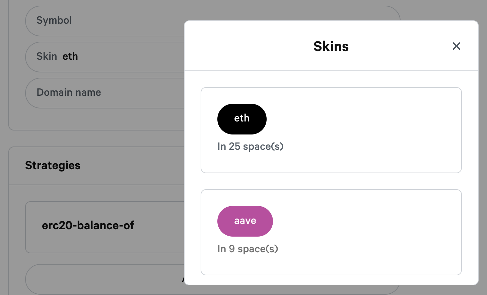

# Add a skin

To create your own skin you need to do a pull request on this repository:



#### Follow the Snapshot skins directory tree

```bash
└── skins
    └── my-space.scss
```

### Add your skin

To add your skin you will need to create a "my-space.scss" file in the "skins" directory.

```css
.my-space {
  --primary-color: #384aff;
  --bg-color: white;
  --text-color: #586069;
  --link-color: #111111;
  --heading-color: #111111;
  --border-color: #d1d5da;
  --header-bg: white;
  --block-bg: transparent;
}
```


Change the file name **my-space.scss** and css selector **.my-space** with your space name.


Select then your skin in the Skin field in your space settings.




After committing your PR, you will have to wait for the merge and the deployment of your PR to be able to select your skin available. This process can take a few hours.


