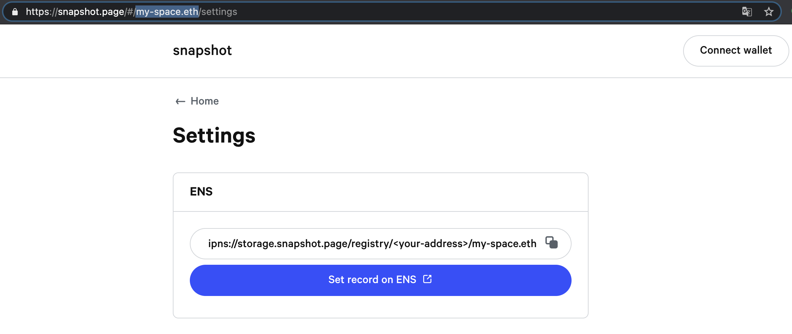
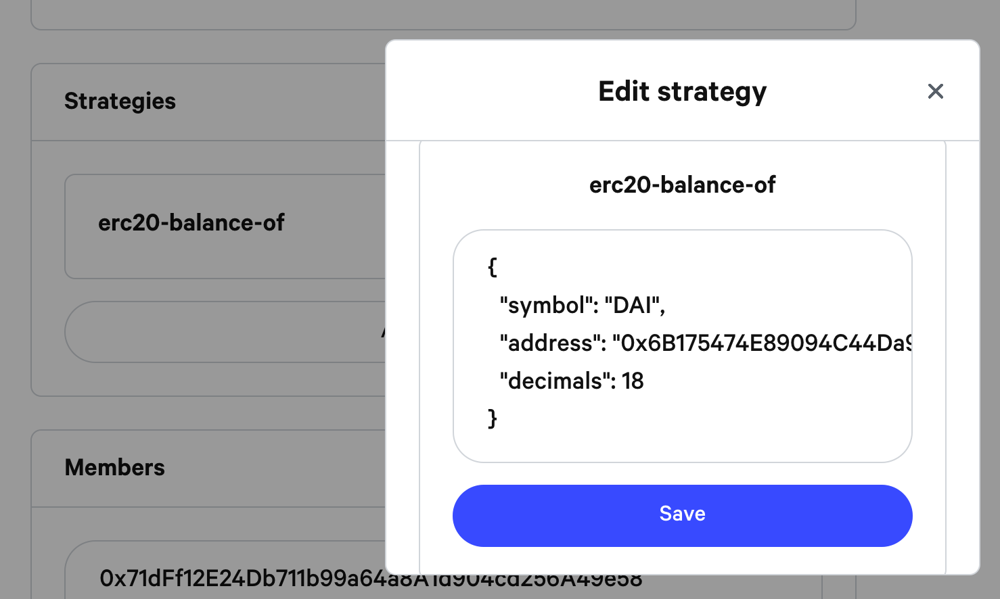

# Create a space with ENS


**If you already have a space see how to** [**Migrate your space to ENS**](migrate-your-space-to-ens.md)**.**


## 1. Get an ENS domain for your space

If you don't have an ENS domain yet for your space you will need to register one. If you need help follow the registrar guide.

**Register ENS domain**  
[https://app.ens.domains](https://app.ens.domains/)

**DNS registrar guide**  
[https://docs.ens.domains/dns-registrar-guide](https://docs.ens.domains/dns-registrar-guide)

## 2. Link your ENS domain to Snapshot with "contenthash"

Once you have created your domain ENS, go on this url using your domain for space name. [https://snapshot.page/\#/**my-space.eth**/settings](https://snapshot.page/#/my-space.eth/settings)


Change **my-space.eth** with your ENS domain and **login** with the wallet owner of the domain name.

**&lt;your-address&gt;** will automatically be replaced by your address when you log in.


If you are on your domain space and connected with your wallet copy the "IPNS link" in the "ENS" field and click on the button **Set record on ENS**, you will get redirected to ENS app.

On the ENS app click on **ADD/EDIT RECORD** and paste the "IPNS link" in the "CONTENT" field.

Click **Confirm** and submit the change.

## **3. Setup your space settings**

Refresh the Snapshot settings page [https://snapshot.page/\#/my-space.eth/settings](https://snapshot.page/#/my-space.eth/settings). Now you can edit your space settings.

### Profile

* **Change avatar** to have your [logo and strategy images in your space](add-avatars.md#add-your-space-logo-and-strategy-image-s).
* **Name** is the name that will be displayed in the snapshot application.
* **Network** must be the network relative to your token.
* **Symbol** is the main token symbol that will be displayed in your space. 
* **Skin** can be left as a default, used as an existing one or you can [create your own skin](add-a-skin.md#add-your-skin).
* **Domain name** is optional but you can [add a custom domain](add-a-custom-domain.md#add-a-custom-domain).

### **Strategies**

You need to add a voting strategy for your proposals. You can choose one by default and edit it by clicking on it to configure your own token in it or keep the default token. For more information on strategies, please refer to the [Strategies](../strategies.md) section.


You can add up to 3 strategies in your space.


### Members and Filters

* **Members** are those who can create official proposals that will be displayed in the "Core" tab. You can add as many addresses as you need, one per line.
* **Default tab** is the one that will be displayed as the default for your space. For example `all` `core` or `community`
* **Minimum score** is the minimum number of tokens required to create a proposal.
* **Only members proposals** is used to allow only members to post proposals and can be set to `true` or `false`
* **Invalids** are the proposals you want to hide from your space. You can add as many proposal ids as you need, one per line.

Click **Save** and **sign settings message** on your wallet.

Now you are set! You can go on [https://snapshot.page/\#/my-space.eth](https://snapshot.page/#/my-space.eth) to see your space.


When you create or edit a space, it take about 3min to see the changes live.


## What you should do now**?**







