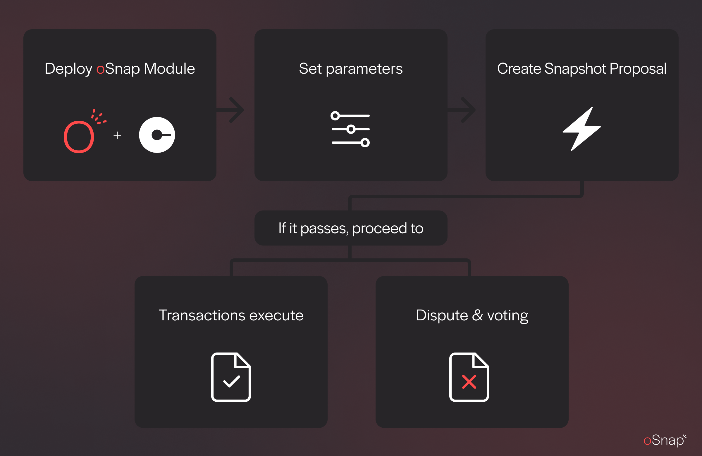

# SafeSnap - oSnap

“oSnap” is short for Optimistic Snapshot Execution. oSnap lets DAOs propose transactions, do an off-chain governance vote, and have the transaction data submitted in a trustless fashion.

## Instructions for using oSnap: 

<figure><figcaption></figcaption></figure>

Setting up the oSnap module:
* Create a Safe and Snapshot Space, or connect to your current accounts. 
* Go to Safe Apps, install the Zodiac app, and install the oSnap module through Zodiac.
* Set the proposal bond, challenge period, and Snapshot Space.
* Link the oSnap module to your Snapshot Space with SafeSnap.
* Your oSnap module address is added to the SafeSnap plugin configuration to enforce the results of proposals on-chain.

Using oSnap with Snapshot:
* Create a proposal and Snapshot vote, along with the transactions to execute if the proposal passes.
* Invite the community to vote on the proposal.
* Once the Snapshot voting period ends, anyone can propose the transactions by posting a bond.
* After the challenge period, execute the transactions on-chain through the Snapshot interface.

## Tutorials

Video tutorial on how to deploy and use an oSnap module:



Follow the oSnap documentation on how to set up an oSnap module for your project.

Deployment tutorial using the Zodiac module:



Snapshot tutorial to configure and execute transactions with Snapshot proposals:



An overview on verifying and disputing proposed transactions:



Updating the oSnap using admin functions:



## Security recommendations

In order to ensure maximal safety we recommend to define several paremeters for your oSnap setup:

* Set a **substantial bond** for an answer
* Select a **long challenge period**
* Set up a **monitoring infrastructure** for proposed transactions

## Additional resources

Learn more about oSnap here:





