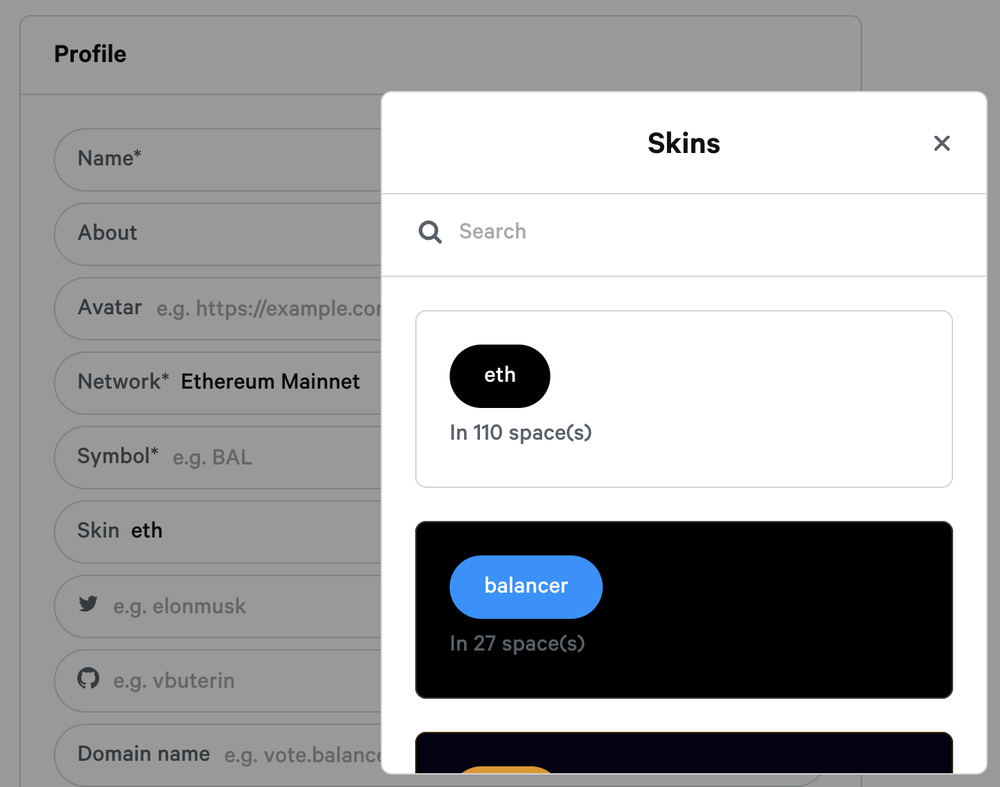
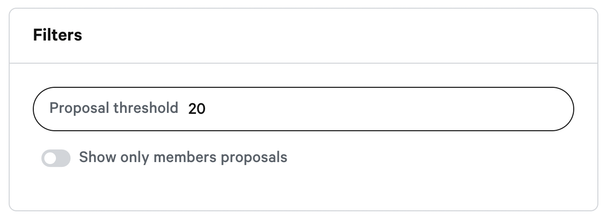

# Create a space


If you already have a space with GitHub see how to [Migrate your space to ENS](https://docs.snapshot.page/spaces/migrate).


### 1. Get an ENS domain for your space

You will need an ENS domain for creating your space, register one here:  
[https://app.ens.domains](https://app.ens.domains/) 

_You need an ENS domain on **Ethereum mainnet** even if you want to use Ethereum testnets or others networks \(Binance Smart Chain, xDAI... etc\)._

If you have never registered an ENS before or need help then checkout this guide:[ https://docs.ens.domains/dns-registrar-guide](https://docs.ens.domains/dns-registrar-guide)

### 2. Link your ENS domain to Snapshot

Once you have created your ENS domain, Go to this url and modify the tag with your ENS domain. `https://snapshot.org/#/`**`<ENS DOMAIN>`**`/settings` and login with the wallet that owns the ENS domain.

Once connected, the **&lt;your-address&gt;** tag will be replaced with your wallet address.


You will need a wallet that can sign message like MetaMask, Fortmatic, Portis, Argent. Don't use a Gnosis Safe has they are currently not supported.


If you are on your domain space and connected with your wallet you will see the correct **IPNS link** in the **ENS field**. Click on the button **Set record on ENS**, and you will get redirected to ENS page.

* On the ENS page, click on **ADD/EDIT RECORD**.
* Select **TEXT** and type the key **"snapshot"** in lowercase.
* Paste the **IPNS link** in the field.
* Click **Save**.
* Scroll down and click **Confirm**.
* Sign the transaction with your wallet.

### **3. Setup your space settings**

Refresh the Snapshot settings page `https://snapshot.org/#/`**`<ENS DOMAIN>`**`/settings` to see the space setting.

#### Profile

* **Name** is the name that will be displayed in your space.
* **About** is the description of your governance purposes.
* **Avatar** is your project logo.
* **Network** must be the network relative to your token.

* **Symbol** is the main token symbol that will be displayed in your space.
* **Skin** can be left as a default, used as an existing one or you can [create your own skin](add-skin.md).

* **Twitter** and **Github** just add a username to link to your different accounts.
* **Domain name** is optional but you can [add a custom domain](add-custom-domain.md).
* **Terms** links to your website's terms and conditions.
* **Hide space from homepage** if you want to keep your space "private".

#### **Strategies**

You need to add a voting strategy for your proposals. `erc20-balance-of` is the most used strategy.


You can add up to 5 strategies in your space.


Once selected, you can edit the strategy by clicking on it if you want to add your own token.

More information here:



#### Admins

The admins will be able to edit the space settings and moderate proposals. You must add one address per line.

#### Members

Members will be able to create proposals without being constrained by filters. You must add one address per line.

#### Filters

* **Proposal threshold** is the minimum number of tokens required to create a proposal.
* **Show only members proposals** is used if you want only proposals created by members to be displayed in the space.

#### Plugins

Plugins give extra features for your space. More information here:



### 4. Save your settings

Click "**Save**" then confirm the action in your wallet.

You are all set! You can go on `https://snapshot.org/#/<ENS_DOMAIN>` to see your space.

### What you can do now**?**





