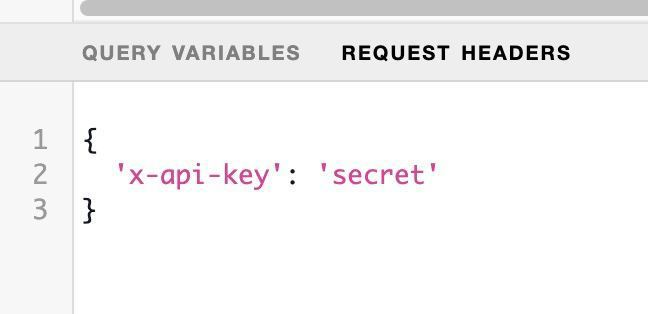

# API Keys

We want to make sure that we limit the risk of the API downtime and provide a reliable and continuous service and therefore we decided to implement API Keys to make sure that the requests are coming from genuine users.

## Limits

Currently we are in a transition period. During the next two months until July 30th the limits for keyless access to the API will not change:

**🔓 No API Key:** 120 requests per 20 seconds.

**🔑 With the API Key:** 2 million requests per month.

After September 12th, the limits will be updated to:

**🔓 No API Key:** 100 requests per minute.

**🔑 With the API Key:** 2 million requests per month.


If you are getting **close to 2M requests a month** please reach out to our team directly on Discord by creating a new ticket in the [#helpdesk-tickets](https://discord.com/channels/707079246388133940/1090290400943677440) channel.


## How can I get an API Key?

### 1. Apply via the request form

If you haven’t already please **fill in the below form** or submit it via [the direct link](https://tally.so/r/3laKWp).

#### API Key Request Form



### 2. Wait 72 hours

We will review your submission and **whitelist the address** you provided in the form.

**After 72 hours** have passed you can continue with the next steps. If you get any errors while generating the key, please create a ticket in the [#helpdesk-tickets](https://discord.com/channels/707079246388133940/1090290400943677440) channel.

### 3. Generate the API Key

After your address has been whitelisted go to [https://app.mycrypto.com/sign-message](https://app.mycrypto.com/sign-message) and connect your wallet using the account you provided in the submission form above.

#### a) Sign the message with keyword `generateKey:`

<figure><figcaption></figcaption></figure>


b) Copy the signature and run the below `curl` command.&#x20;

```javascript
curl --location '<https://keycard.snapshot.org/>' \\
--header 'accept: application/json' \\
--header 'content-type: application/json' \\
--data '{
    "jsonrpc": "2.0",
    "method": "generate_key",
    "params": {
        "sig": "<SIGNATURE_HASH>"
    },
    "id": "123456789"
}'
```

Make sure to use the signature hash from step 5 in the `sig` param, **do not paste** the entire response after signing the message. As an example:

```javascript
...
    "method": "generate_key",
    "params": {
        "sig": "0x85bcabdeb3b43131364d21b32f8c74124d155009fc9d6d40901b4b725f23e0ac632808ebb00f3569bf875ded07b61ac5163ebe757b0897278ab276cdc982e3001c"
    },
...
```

You will receive the API Key as a response of the `curl` request. Make sure to store it securely.

## How to structure the query with my key?

The only change you need to make is to add the API Key in the headers of your request:

```bash
curl 'https://hub.snapshot.org/graphql?' \
  -H 'accept: application/json' \
  -H 'x-api-key: <YOUR-API-KEY>' \
  --data-raw '{"query":"\n{\n space(id:\"snapshot.dcl.eth\"){\n  id\n  name\n  members\n}\n}","variables":null}' \
  --compressed
```

Alternatively, you can use the `apiKey` param in the query string with your key as a value:

```bash
curl 'https://hub.snapshot.org/graphql?apiKey=<YOUR_API_KEY>' \
  -H 'accept: application/json' \
  --data-raw '{"query":"\n{\n space(id:\"snapshot.dcl.eth\"){\n  id\n  name\n  members\n}\n}","variables":null}' \
  --compressed
```

If you are using the GraphQL interface you need to provide your key in the `headers` tab:

<figure><figcaption></figcaption></figure>
