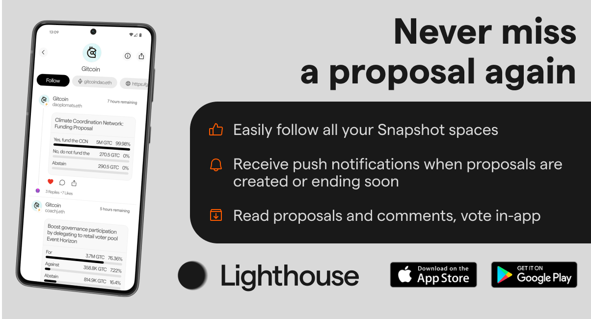

## Lighthouse

[Lighthouse](https://lighthouse.cx/download?utm_source=snapshot_org) connects you to all your Snapshot spaces and keeps you updated with push notifications whenever a proposal is created or ending soon. Read proposals and comments, and even vote without leaving the app. Everything is cryptographically verified, allowing you to focus on the content that matters.

If you own or manage a space, Lighthouse also enables you to securely communicate with your voters, analyze engagement, and more.

<figure><figcaption></figcaption></figure>
