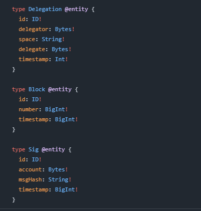
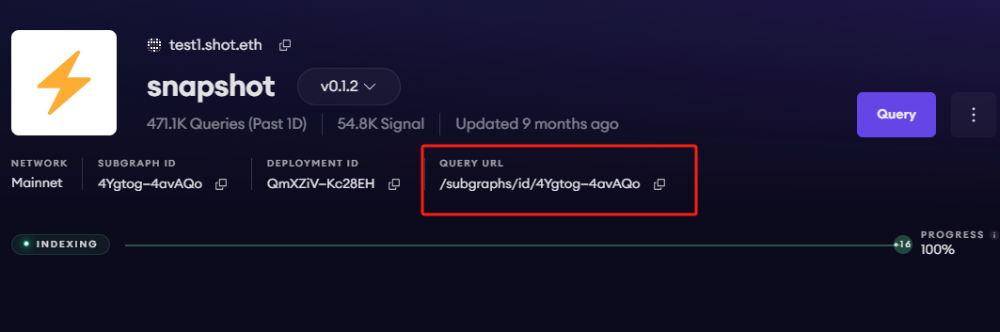
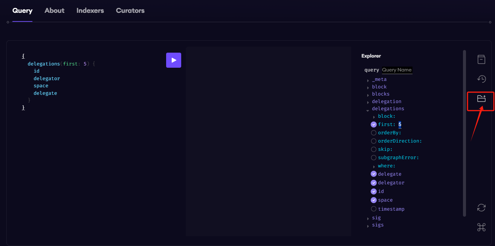

# Subgraphs

Snapshot’s onchain data can be easily queried with open APIs known as subgraphs. Subgraphs are decentralized APIs powered by The Graph, a protocol for indexing & querying data from blockchains.

## The Snapshot Subgraph

You can see an interactive query playground on the [Snapshot subgraph’s page on The Graph Explorer](https://thegraph.com/explorer/subgraphs/4YgtogVaqoM8CErHWDK8mKQ825BcVdKB8vBYmb4avAQo?view=Query\&chain=arbitrum-one), where you can test any query.

Check out the following examples:

```graphql
Example Query: Get the first 5 delegations from Snapshot
{
  delegations(first: 5) {
    id
    delegator
    space
    delegate
  }
}
```

Example output

```json
{
  "data": {
    "delegations": [
      {
        "delegate": "0xde1e6a7ed0ad3f61d531a8a78e83ccddbd6e0c49",
        "delegator": "0x00000000005ef87f8ca7014309ece7260bbcdaeb",
        "id": "0x00000000005ef87f8ca7014309ece7260bbcdaeb-cvx.eth-0xde1e6a7ed0ad3f61d531a8a78e83ccddbd6e0c49",
        "space": 
      },
  //…
     ]}
}
```

## Schema

The schema for this subgraph is defined [here in Snapshot’s GitHub](https://github.com/snapshot-labs/snapshot-subgraph/blob/master/schema.graphql).

<figure><figcaption></figcaption></figure>

## Snapshot Subgraph endpoint

https://gateway.thegraph.com/api/\[api-key]/subgraphs/id/4YgtogVaqoM8CErHWDK8mKQ825BcVdKB8vBYmb4avAQo

This is visible from the [Snapshot subgraph’s page](https://thegraph.com/explorer/subgraphs/4YgtogVaqoM8CErHWDK8mKQ825BcVdKB8vBYmb4avAQo?view=Query\&chain=arbitrum-one) on Graph Explorer.

<figure><figcaption></figcaption></figure>

## How to obtain your own API key

1. Go to [thegraph.com/studio](https://thegraph.com/studio) and connect your wallet.
2. Go to [https://thegraph.com/studio/apikeys/](https://thegraph.com/studio/apikeys/) to create an API key.
3. You can use this API key on any subgraph on [Graph Explorer](https://thegraph.com/explorer), and it’s not limited to just Snapshot.

## Other Snapshot Subgraphs

* [**Snapshot on Arbitrum**](https://thegraph.com/explorer/subgraphs/HuLBhuKuknXEEUmVmKR8Lsmpi5h1SfNLGcaa1e9tWyMG?view=Query\&chain=arbitrum-one)
* [**Snapshot on Fantom**](https://thegraph.com/explorer/subgraphs/szZ3FWewDGHtpeZzf6uQ5dxPY68JNfrGPoWqBXwtBXR?view=Query\&chain=arbitrum-one)
* [**Snapshot on Gnosis Chain**](https://thegraph.com/explorer/subgraphs/2XuuZyGrxw72keXKfeHQW7yaGqVa7dyoghkgdGMdC6Az?view=Query\&chain=arbitrum-one)

[See all other subgraphs published by Snapshot Labs.](https://thegraph.com/explorer/profile/0x8c28cf33d9fd3d0293f963b1cd27e3ff422b425c?view=Subgraphs\&chain=arbitrum-one)

## How to Query through the API

You can pass any GraphQL query to the Snapshot endpoint and receive data in JSON format.

This following code example will return the exact same output as above.

### Sample code (Node.js):

```javascript
const axios = require('axios');

const graphqlQuery = `{
  delegations(first: 5) {
    id
    delegator
    space
    delegate
  }
}`;

const queryUrl = 'https://gateway.thegraph.com/api/[api-key]/subgraphs/id/4YgtogVaqoM8CErHWDK8mKQ825BcVdKB8vBYmb4avAQo';

const graphQLRequest = {
  method: 'post',
  url: queryUrl,
  data: {
    query: graphqlQuery,
  },
};

// Send the GraphQL query
axios(graphQLRequest)
  .then((response) => {
    // Handle the response here
    const data = response.data.data;
    console.log(data);
  })
  .catch((error) => {
    // Handle any errors
    console.error(error);
  });
```

## How to use the Visual Query Editor

You can use the GraphiQL Explorer to compose your GraphQL queries by clicking on the fields you want.

<figure><figcaption></figcaption></figure>

## About The Graph

The Graph is a decentralized protocol that enables seamless querying and indexing of blockchain data. It simplifies the complex process of querying blockchain data through the use of subgraphs (open APIs).

## Benefits of using The Graph

* Anyone can query subgraphs on The Graph
* All users get 100,000 free queries per month
* Unlocking more queries is a seamless experience, you can pay with crypto or a credit card

## Additional resources

For more information about querying data from your subgraph, [read more here](https://thegraph.com/docs/en/querying/querying-the-graph/).

To explore all the ways you can optimize & customize your subgraph for a better performance, read more about [creating a subgraph here](https://thegraph.com/docs/en/developing/creating-a-subgraph/).
